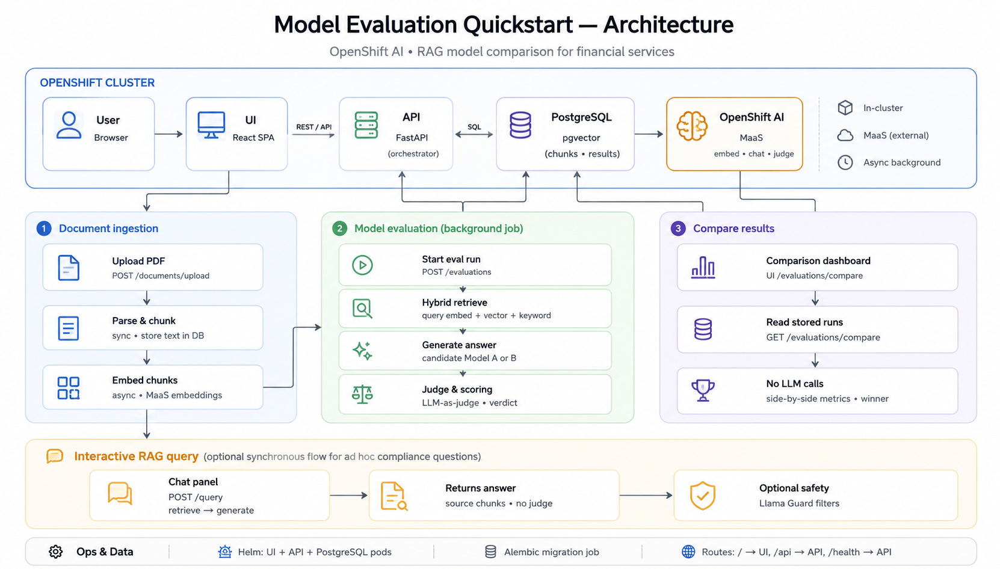

# Evaluate and Compare Models in Financial Services

Compare candidate LLMs for RAG workloads using automated evaluation metrics -- deploy on OpenShift AI with zero GPUs required.

## Table of Contents

- [Overview](#overview)
- [Detailed description](#detailed-description)
  - [See it in action](#see-it-in-action)
  - [Architecture diagrams](#architecture-diagrams)
- [Requirements](#requirements)
  - [Minimum hardware requirements](#minimum-hardware-requirements)
  - [Minimum software requirements](#minimum-software-requirements)
  - [Required user permissions](#required-user-permissions)
- [Deploy](#deploy)
  - [Prerequisites](#prerequisites)
  - [Installation](#installation)
  - [Validating the deployment](#validating-the-deployment)
  - [Delete](#delete)
- [Repository structure](#repository-structure)
- [References](#references)
- [Technical details](#technical-details)
- [Tags](#tags)

## Overview

Financial services organizations building RAG applications need to evaluate which LLM best fits their domain before committing to production. This quickstart automates that process: upload your documents, run evaluation questions against multiple models, and compare results using industry-standard metrics -- all without requiring GPUs.

## Detailed description

Banks, insurers, and securities firms increasingly use retrieval-augmented generation to answer questions over regulatory filings, compliance documents, and internal knowledge bases. Choosing the wrong model leads to hallucinated answers in high-stakes contexts -- a costly mistake when dealing with SEC filings, FINRA regulations, or client-facing financial advice.

This quickstart deploys a complete model evaluation workflow on OpenShift AI. Users upload domain-specific PDFs (such as public SEC filings or banking regulations), define evaluation questions, and run automated assessments against candidate models available through OpenShift AI Model-as-a-Service. The system scores each model on faithfulness, answer relevancy, context precision, and hallucination rate, then presents a side-by-side comparison dashboard with clear winner indicators.

The evaluation framework distinguishes between two failure modes that matter in financial services: generator hallucination (where smaller models fabricate answers) and retriever misses (where the chunking strategy fails to surface relevant context). This distinction helps teams make informed decisions about both model selection and RAG pipeline tuning.

### See it in action

https://github.com/user-attachments/assets/f6924c9b-5e54-4ccb-86e4-ef7fde892683

### Architecture diagrams



The FastAPI API orchestrates all workflows in a single pod — there are no separate embedding or worker services. Document ingestion parses and chunks PDFs synchronously, then embeds chunks via OpenShift AI MaaS in a background task. Model evaluation runs as an async background job: hybrid retrieval (pgvector + keyword search), candidate model generation, and LLM-as-judge scoring. The comparison dashboard reads stored evaluation runs from PostgreSQL with no additional LLM calls.

## Requirements

### Minimum hardware requirements

**Application (MaaS mode -- no GPU required):**

| Component | CPU Request | CPU Limit | Memory Request | Memory Limit |
|-----------|------------|-----------|----------------|--------------|
| API | 250m | 1000m | 512Mi | 1Gi |
| UI | 100m | 500m | 128Mi | 256Mi |
| Database | 100m | 500m | 256Mi | 512Mi |
| **Total** | **450m** | **2000m** | **896Mi** | **1.75Gi** |

**Storage:** 10Gi persistent volume for PostgreSQL database.

**Self-hosted model serving (optional):** If deploying models on-cluster instead of using MaaS, GPU resources are required. See chart [values.yaml](chart/values.yaml) for `llm-service` configuration. Supported GPUs: NVIDIA A10, A100, L40S, or T4.

### Minimum software requirements

| Software | Version |
|----------|---------|
| Red Hat OpenShift | 4.14 or later |
| Red Hat OpenShift AI | 2.22 or later (for MaaS endpoint) |
| `oc` CLI | 4.14 or later |
| `helm` CLI | 3.12 or later |

### Required user permissions

This quickstart can be deployed by any user with:

- Permission to create projects/namespaces
- Permission to deploy applications via Helm
- No cluster-admin access required

## Deploy

### Prerequisites

Before deploying, ensure you have:

- Access to a Red Hat OpenShift cluster with OpenShift AI 2.22+ installed
- `oc` CLI installed and authenticated to your cluster
- `helm` CLI installed
- API token for the MaaS model endpoint

### Installation

1. Clone the repository:

```bash
git clone https://github.com/rh-ai-quickstart/model-evaluation.git
cd model-evaluation
```

2. Create a new OpenShift project:

```bash
PROJECT="model-evaluation"
oc new-project ${PROJECT}
```

3. Install using Helm:

**Option A: Use MaaS models (recommended -- no GPU required)**

```bash
helm install model-eval ./chart --namespace ${PROJECT} \
  --set secrets.API_TOKEN="YOUR_API_TOKEN"
```

The default configuration uses these models via MaaS:

| Role | Default Model |
|------|--------------|
| Model A | Granite-3.3-8B-Instruct |
| Model B | Llama-4-Scout-17B-16E-W4A16 |
| Embedding | Nomic-embed-text-v2-moe |
| Judge | Mistral-Small-24B-W8A8 |

To use different models:

```bash
helm install model-eval ./chart --namespace ${PROJECT} \
  --set secrets.API_TOKEN="YOUR_API_TOKEN" \
  --set models.modelA.name="YOUR_MODEL_A" \
  --set models.modelB.name="YOUR_MODEL_B" \
  --set models.maasEndpoint="YOUR_MAAS_ENDPOINT"
```

**Option B: Deploy with self-hosted models (requires GPU)**

```bash
helm install model-eval ./chart --namespace ${PROJECT} \
  --set secrets.API_TOKEN="YOUR_API_TOKEN" \
  --set llm-service.enabled=true \
  --set models.modelA.deploymentMode=self-hosted \
  --set models.modelB.deploymentMode=self-hosted
```

> **Note**: Option B requires GPU resources available in your cluster. See [Minimum hardware requirements](#minimum-hardware-requirements) for details.

#### Testing model access (before deploying)

Verify your MaaS endpoint is reachable before installing:

```bash
oc run test-model-access --rm -it --restart=Never \
  --image=registry.access.redhat.com/ubi9/ubi-minimal:latest \
  -- /bin/sh -c 'curl -sf --max-time 10 \
    -H "Authorization: Bearer YOUR_API_TOKEN" \
    -H "Content-Type: application/json" \
    -d "{\"model\": \"YOUR_MODEL_NAME\", \"messages\": [{\"role\": \"user\", \"content\": \"Say hello in one word.\"}], \"max_tokens\": 10}" \
    "YOUR_MAAS_ENDPOINT/v1/chat/completions" && echo "" && echo "SUCCESS" || echo "FAILED"'
```

### Validating the deployment

1. Check all pods are running:

```bash
oc get pods -n ${PROJECT}
```

2. Verify the database migration completed:

```bash
oc logs job/model-evaluation-migration -n ${PROJECT}
```

3. Get the application URL:

```bash
echo "https://$(oc get route/model-evaluation-ui-route -n ${PROJECT} --template='{{.spec.host}}')"
```

4. Test the health endpoint:

```bash
curl -sk "https://$(oc get route/model-evaluation-health-route -n ${PROJECT} --template='{{.spec.host}}')/health/"
```

### Delete

To completely remove the deployment:

1. Uninstall the Helm release:

```bash
helm uninstall model-eval --namespace ${PROJECT}
```

2. (Optional) Remove persistent volume claims:

```bash
oc delete pvc -l app.kubernetes.io/instance=model-eval -n ${PROJECT}
```

3. (Optional) Delete the project:

```bash
oc delete project ${PROJECT}
```

## Repository structure

```
.
├── chart/                    # Helm chart for deploying the quickstart
│   ├── Chart.yaml            # Chart metadata and dependencies
│   ├── values.yaml           # Default configuration values
│   └── templates/            # Kubernetes resource templates
├── packages/
│   ├── ui/                   # React frontend (Vite + TanStack Router/Query)
│   ├── api/                  # FastAPI backend (evaluation orchestration)
│   └── db/                   # SQLAlchemy models + Alembic migrations
├── docs/
│   └── images/
│       └── architecture-overview.png   # Architecture diagram (see above)
├── LICENSE
└── README.md
```

## References

- [Red Hat OpenShift AI Documentation](https://docs.redhat.com/en/documentation/red_hat_openshift_ai_self-managed/)
- [AI Quickstart Contributing Guide](https://github.com/rh-ai-quickstart/ai-quickstart-contrib/blob/main/CONTRIBUTING.md)

## Technical details

### Evaluation metrics

Metric names follow common RAG evaluation terminology. Scores are produced by a **consolidated LLM-as-judge** over OpenShift AI MaaS.

| Metric | What it measures |
|--------|-----------------|
| **Faithfulness (groundedness)** | Whether the answer is grounded in the retrieved context (scores below 0.7 indicate hallucination) |
| **Answer relevancy** | Whether the answer addresses the question asked |
| **Context precision** | Whether the retrieved chunks are relevant to the question |
| **Context relevancy** | Whether the retrieval pipeline surfaces useful context |
| **Completeness** | Coverage of the expected answer (when ground truth is provided) |
| **Correctness** | Factual alignment with the expected answer |
| **Compliance accuracy** | Domain-specific regulatory/compliance alignment (FSI profiles) |
| **Abstention quality** | Whether the model appropriately declines when context is insufficient |

Deterministic checks (document presence, chunk alignment) and profile-based verdicts (PASS / FAIL / REVIEW) complement judge scores. Configure `JUDGE_MODEL_NAME` to a model distinct from the candidates under test.

### Tech stack

| Layer | Technology |
|-------|-----------|
| Frontend | React 19, Vite, TanStack Router/Query, Tailwind CSS |
| Backend | FastAPI, async Python, Pydantic v2 |
| Database | PostgreSQL + pgvector, SQLAlchemy 2.0, Alembic |
| Deployment | Helm on OpenShift, TLS-terminated routes |

### API endpoints

Once deployed, the API is available at the route path `/api`. Interactive API documentation (Swagger UI) is accessible at `/api/docs`.

## Tags

**Title:** Evaluate and Compare Models in Financial Services
**Description:** Compare candidate LLMs for RAG workloads using automated evaluation metrics -- deploy on OpenShift AI with zero GPUs required.
**Industry:** Banking and securities
**Product:** OpenShift AI
**Use case:** Productivity
**Partner:** N/A
**Contributor org:** Red Hat
